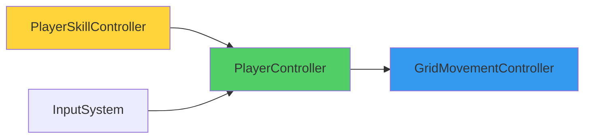

# PlayerSkillController 분리 계획

## 목표

현재 `GridMovementController`가 이동 로직과 스킬 로직을 동시에 담당하여 단일 책임 원칙(SRP)을 위배하고 있습니다. `PlayerSkillController`를 새로 생성하여 스킬 관리 책임을 분리하고, `PlayerController`를 Facade 패턴으로 활용하여 의존성을 단방향으로 정리합니다.

---

## 현재 구조의 문제점

### 1. GridMovementController의 과도한 책임
```
GridMovementController (417줄)
├─ 이동 로직 (Move, MoveToGridPositionAsync)
├─ 회피 스킬 로직 (PerformDodge, TryDodge, DodgeAsync, CalculateDodgePath)
├─ 장애물 판정 (GetObstacleType)
└─ MovementSkillData 관리
```

**문제:**
- "이동 컨트롤러"가 스킬까지 관리
- 향후 스킬 추가 시 파일이 계속 비대해짐
- 테스트 시 이동과 스킬을 분리할 수 없음

### 2. 의존성 문제 예상
만약 단순히 PlayerSkillController를 만들면:
```
PlayerController ──→ GridMovementController
PlayerSkillController ──→ GridMovementController  (중복 참조)
```
→ 두 컴포넌트가 같은 대상 참조 = 결합도 증가

---

## 제안하는 아키텍처

### 1. Facade 패턴 적용



**핵심 아이디어:**
- PlayerController를 "이동 요청의 단일 진입점"으로 확장
- PlayerSkillController는 GridMovementController를 직접 몰라도 됨
- 단방향 의존성: `SkillController → PlayerController → MovementController`

### 2. 책임 분리

| **PlayerController** | • Input System 구독<br/>• 이동 요청 Facade (RequestMove, RequestMoveToPosition)<br/>• 전체 상태 통합 (IsMoving, CurrentGridPosition, FacingDirection) |
| **GridMovementController** | • 순수 이동 로직만<br/>• 그리드 좌표 계산<br/>• **스킬/장애물 판정 제거** |
| **PlayerSkillController** | • 모든 스킬 관리<br/>• MovementSkillData 관리<br/>• 회피 경로 계산<br/>• **장애물 판정은 MapManager로 위임 예정** |

---

## Proposed Changes

### Component 1: PlayerSkillController (신규 생성)

#### [NEW] [PlayerSkillController.cs](file:///c:/Users/zse63/unity/Grid-Action-Rush/Assets/Scripts/Player/PlayerSkillController.cs)

**생성할 내용:**
- MovementSkillData 관리 (GridMovementController에서 이동)
- 회피 경로 계산 로직 (CalculateDodgePath)
- ~~장애물 판정 로직 (GetObstacleType)~~ **MapManager로 위임**
- PerformDodge 메서드 (PlayerController를 통해 이동 요청)

**핵심 메서드:**
```csharp
public void PerformDodge()
{
    if (playerController.IsMoving) return;
    if (dodgeSkillData == null) return;

    Vector2Int currentPos = playerController.CurrentGridPosition;
    Vector2Int facingDir = playerController.FacingDirection;
    
    // 회피 경로 계산 (장애물 판정은 임시로 비활성화, MapManager 구현 대기)
    Vector2Int targetPos = CalculateDodgePath(currentPos, facingDir, dodgeSkillData.dashDistance);
    
    // PlayerController를 통해 이동 요청 (GridMovementController 직접 참조 안 함)
    playerController.RequestMoveToPosition(targetPos, dodgeSkillData.speedMultiplier);
}
```

> [!NOTE]
> `GetObstacleType` 메서드는 제거되었습니다. 향후 MapManager 구현 후
> `mapManager.GetObstacleType(nextPos)`로 호출할 예정입니다.

---

### Component 2: PlayerController (Facade 확장)

#### [MODIFY] [PlayerController.cs](file:///c:/Users/zse63/unity/Grid-Action-Rush/Assets/Scripts/Player/PlayerController.cs)

**변경 내용:**
- PlayerSkillController 참조 추가
- 이동 요청 Facade 메서드 추가
- OnDodgePerformed에서 SkillController 호출

**추가할 메서드:**
```csharp
/// <summary>
/// 一般移動リクエスト（Facadeメソッド）
/// </summary>
public void RequestMove(Vector2Int direction)
{
    movementController?.Move(direction);
}

/// <summary>
/// 指定座標への移動リクエスト（スキル用、Facadeメソッド）
/// </summary>
public void RequestMoveToPosition(Vector2Int targetPos, float speedMultiplier)
{
    movementController?.MoveToPosition(targetPos, speedMultiplier);
}
```

**OnDodgePerformed 수정:**
```csharp
private void OnDodgePerformed(InputAction.CallbackContext context)
{
    if (skillController == null) return;
    skillController.PerformDodge();  // SkillController에 위임
}
```

**추가 프로퍼티 (SkillController가 참조할 수 있도록):**
```csharp
public Vector2Int CurrentGridPosition => movementController?.CurrentGridPosition ?? Vector2Int.zero;
```

---

### Component 3: GridMovementController (단순화)

#### [MODIFY] [GridMovementController.cs](file:///c:/Users/zse63/unity/Grid-Action-Rush/Assets/Scripts/Player/GridMovementController.cs)

**제거할 코드:**
- Lines 19-22: `dodgeSkill`, `obstacleLayerMask` 필드
- Lines 216-327: 회피 스킬 전체 섹션 (`TryDodge`, `DodgeAsync`, `CalculateDodgePath`)
- Lines 329-363: 장애물 판정 섹션 (`GetObstacleType`)
- `PerformDodge()` 메서드

**추가할 메서드:**
```csharp
/// <summary>
/// 指定座標への移動（外部から座標と速度を指定）
/// スキルシステムから呼び出される
/// </summary>
public void MoveToPosition(Vector2Int targetPos, float speedMultiplier)
{
    if (isMoving) return;

    moveCts?.Cancel();
    moveCts?.Dispose();
    moveCts = new CancellationTokenSource();

    MoveToGridPositionAsync(targetPos, speedMultiplier, moveCts.Token).Forget();
}
```

**MoveToGridPositionAsync 수정:**
```csharp
// 오버로드 추가 (속도 배율 지원)
private async UniTask MoveToGridPositionAsync(Vector2Int targetGridPos, float speedMultiplier, CancellationToken ct)
{
    // duration 계산 시 speedMultiplier 적용
    float duration = 1f / (moveSpeed * speedMultiplier);
    // ... 나머지 로직 동일
}
```

**추가 프로퍼티:**
```csharp
public Vector2Int CurrentGridPosition => currentGridPosition;
```

---

## 의존성 그래프 변화

### Before
```
PlayerController ──→ GridMovementController (이동만 요청)
GridMovementController (이동 + 스킬 로직 포함)
```

### After
```
InputSystem ──→ PlayerController ──→ GridMovementController (순수 이동)
                     ↓
               PlayerSkillController ──┘ (역참조)
```

**개선점:**
- 단방향 의존성
- 각 컴포넌트의 책임 명확화
- SkillController는 MovementController 존재를 몰라도 됨

---

## 검증 계획

### Unity Editor 수동 테스트

1. **기본 이동 확인**
   - 방향키로 정상 이동하는지
   
2. **회피 스킬 확인**
   - Space 키로 회피가 정상 작동하는지
   - 장애물 판정이 정상 작동하는지
   
3. **Inspector 설정 확인**
   - PlayerSkillController에 MovementSkillData 설정
   - ~~PlayerSkillController에 ObstacleLayerMask 설정~~ (제거됨)
   - PlayerController에 SkillController 자동 연결 확인

---

## 향후 확장 예시

새로운 대시 스킬 추가 시:

```csharp
// PlayerSkillController.cs에만 추가
[SerializeField] private MovementSkillData dashSkillData;

public void PerformDash()
{
    Vector2Int targetPos = CalculateDashPath(...);
    playerController.RequestMoveToPosition(targetPos, dashSkillData.speedMultiplier);
}

// PlayerController.cs에 한 줄만 추가
inputActions.Player.Dash.performed += context => skillController?.PerformDash();
```

**GridMovementController는 전혀 수정 불필요!**

---

## Git 커밋 전략

```
feat: PlayerSkillControllerを新規作成しスキルロジックを分離

- PlayerSkillController: 全スキル管理を担当
- GridMovementController: 純粋な移動ロジックのみに単純化
- PlayerController: Facadeパターンで移動リクエストを統合管理
- 依存関係を単方向化し、拡張性を向上

Changes:
- [NEW] PlayerSkillController.cs: スキル管理の新規コンポーネント
- [MODIFY] GridMovementController.cs: 回避ロジック削除、417行→約250行
- [MODIFY] PlayerController.cs: Facadeメソッド追加
```


---

## 실제 구현 상태 (2026-02-14 업데이트)

### PlayerSkillController 특이사항

> [!NOTE]
> 장애물 판정 로직(`GetObstacleType`)은 **제거되었습니다**.
> 향후 `MapManager` 구현 후 위임할 예정입니다.
> 현재는 임시로 `ObstacleType.None`을 반환합니다.

**현재 상태:**
- ✅ 회피 스킬 로직 구현 완료
- ✅ 회피 경로 계산 완료
- ⏳ 장애물 판정은 MapManager 구현 대기 중 (임시로 비활성화)

**Inspector 설정:**
- ~~Obstacle Layer Mask~~ (제거됨)
- Dodge Skill Data만 설정

---

## 최종 책임 분리

| 컴포넌트 | 책임 |
|---------|------|
| **PlayerController** | • Input System 구독<br/>• Facade 메서드 (RequestMove, RequestMoveToPosition)<br/>• 전체 상태 통합 (IsMoving, CurrentGridPosition, FacingDirection) |
| **GridMovementController** | • 순수 이동 로직만<br/>• 그리드 좌표 계산<br/>• **스킬/장애물 판정 제거** (238줄) |
| **PlayerSkillController** | • 모든 스킬 관리<br/>• MovementSkillData 관리<br/>• 회피 경로 계산<br/>• **장애물 판정은 MapManager로 위임 예정** |
| **MapManager** | • (미구현) 장애물 판정<br/>• 그리드 데이터 관리 |

