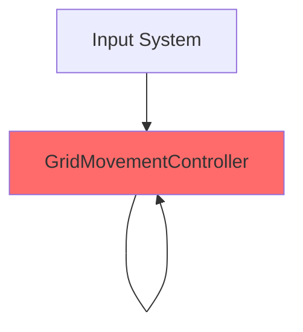
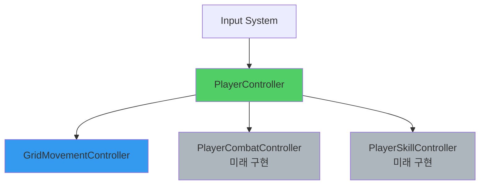

# PlayerController 통합 계획

## 목표

현재 `GridMovementController`가 직접 Input System을 처리하고 있어 단일 책임 원칙(SRP)에 위배됩니다. `PlayerController`를 중앙 입력 허브로 만들어 각 컴포넌트의 책임을 명확히 분리하고, 향후 공격/스킬 시스템 추가 시 확장성을 확보합니다.

---

## User Review Required

> [!IMPORTANT]
> 이 리팩토링은 기존 동작을 변경하지 않지만, 코드 구조를 크게 변경합니다. 다음 사항을 확인해주세요:
> - Input System 이벤트 구독이 `PlayerController`로 이동하는 것에 동의하시는지
> - `GridMovementController`가 public 메서드를 통해서만 호출되는 구조로 변경되는 것이 적절한지

---

## 현재 아키텍처 문제점

### 1. 책임 분리 미흡


**문제점:**
- `GridMovementController`가 입력 처리와 이동 로직을 모두 담당
- 새로운 기능(공격, 스킬) 추가 시 각 컨트롤러가 독립적으로 Input을 구독해야 함
- `PlayerController`는 존재하지만 실질적으로 사용되지 않음

### 2. 확장성 부족
향후 다음 컴포넌트들이 추가될 예정:
- `PlayerCombatController`: 공격 로직
- `PlayerSkillController`: 스킬 관리
- `PlayerAnimationController`: 애니메이션 제어

현재 구조에서는 각 컨트롤러가 Input System을 중복 구독해야 하며, 이는 다음 문제를 야기:
- 입력 우선순위 관리 어려움
- 상태 동기화 복잡성 증가
- 디버깅 난이도 상승

---

## 제안하는 아키텍처

### 1. 새로운 구조


**개선점:**
- **PlayerController**: 입력의 단일 진입점, 상태 관리, 컴포넌트 간 조정
- **GridMovementController**: 순수 이동 로직만 담당 (public 메서드 제공)
- **확장성**: 새 컴포넌트 추가 시 PlayerController에만 연결하면 됨

### 2. 책임 분리

| 컴포넌트 | 책임 |
|---------|------|
| **PlayerController** | • Input System 구독 및 이벤트 라우팅<br/>• 플레이어 상태 관리 (`isMoving`, `isAttacking` 등)<br/>• 컴포넌트 간 충돌 방지 (예: 공격 중 이동 불가)<br/>• Facade 메서드 제공 (RequestMove, RequestMoveToPosition) |
| **GridMovementController** | • 그리드 이동 계산<br/>• **Input 처리 제거**<br/>• **스킬 로직 제거** (PlayerSkillController로 이동) |
| **PlayerSkillController** | • 모든 스킬 관리<br/>• 회피 경로 계산<br/>• ~~장애물 판정~~ (MapManager로 위임 예정) |

---

## Proposed Changes

### Component: Player Controller (중앙 허브)

#### [MODIFY] [PlayerController.cs](file:///c:/Users/zse63/unity/Grid-Action-Rush/Assets/Scripts/Player/PlayerController.cs)

**변경 내용:**
- Input System 초기화 및 이벤트 구독
- 이동/회피 입력을 `GridMovementController`로 위임
- 향후 공격/스킬 입력을 위한 확장 포인트 마련
- 플레이어 상태 프로퍼티 노출 (다른 시스템에서 참조 가능)

**주요 추가 메서드:**
```csharp
// Input 이벤트 핸들러
private void OnMovePerformed(InputAction.CallbackContext context)
private void OnDodgePerformed(InputAction.CallbackContext context)
// 향후: OnAttackPerformed, OnSkillPerformed 등

// 상태 프로퍼티
public bool IsMoving => movementController.IsMoving;
```

---

### Component: Movement Controller (순수 로직)

#### [MODIFY] [GridMovementController.cs](file:///c:/Users/zse63/unity/Grid-Action-Rush/Assets/Scripts/Player/GridMovementController.cs)

**변경 내용:**
- `InputSystem_Actions` 관련 코드 완전 제거
- `OnMovePerformed`, `OnDodgePerformed` 메서드 제거
- 대신 public 메서드로 외부 호출 인터페이스 제공:
  - `public void Move(Vector2Int direction)`
  - `public void PerformDodge()`
- `isMoving` 상태를 외부에서 확인 가능하도록 프로퍼티 추가
  - `public bool IsMoving => isMoving;`

**제거할 코드 범위:**
- Lines 29-30: `InputSystem_Actions` 변수
- Lines 49-58: `OnEnable` 내 이벤트 구독
- Lines 60-66: `OnDisable` 내 이벤트 구독 해제
- Lines 108-147: `OnMovePerformed` 메서드
- Lines 221-224: `OnDodgePerformed` 메서드

**추가할 코드:**
- Public 메서드: `Move()`, `PerformDodge()`
- Public 프로퍼티: `IsMoving`, `FacingDirection`

---

## Verification Plan

### Automated Tests
현재 프로젝트에는 Unit Test 환경이 없으므로 수동 테스트로 대체합니다.

### Manual Verification

1. **Unity Editor 플레이 테스트**
   - 방향키로 이동이 정상 작동하는지 확인
   - Space 키로 회피 스킬이 정상 작동하는지 확인
   - 이동/회피 중 입력 무시가 올바르게 동작하는지 확인

2. **Gizmo 시각화 확인**
   - Scene View에서 현재 그리드 위치 표시 확인
   - 향하는 방향 화살표 표시 확인

3. **Inspector 설정 확인**
   - PlayerController에 GridMovementController가 자동으로 연결되는지 확인
   - 기존 Grid, dodgeSkill 참조가 유지되는지 확인

4. **콘솔 로그 확인**
   - 에러 메시지가 없는지 확인
   - 누락된 컴포넌트 경고가 없는지 확인

---

## 향후 확장 예시

리팩토링 후, 공격 시스템을 추가할 때 다음과 같이 간단하게 확장 가능합니다:

```csharp
// PlayerController.cs에 추가
private PlayerCombatController combatController;

private void OnAttackPerformed(InputAction.CallbackContext context)
{
    if (IsMoving) return;  // 이동 중에는 공격 불가
    combatController?.PerformAttack(movementController.FacingDirection);
}
```

이처럼 **PlayerController만 수정하면** 새로운 기능을 추가할 수 있습니다.

---

## Git Commit Strategy

리팩토링 완료 후 다음 커밋 메시지를 제안합니다:

```
refactor: PlayerControllerを入力処理の中央ハブとして再設計

- InputSystemのイベント購読をPlayerControllerに集約
- GridMovementControllerから入力処理ロジックを分離
- 移動コントローラーは純粋なロジック層として再定義
- 将来的な戦闘・スキルシステムの拡張性を確保
```
